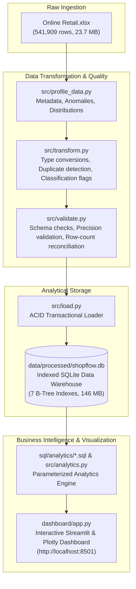

# ShopFlow — E-commerce Sales Data Pipeline & Analytics Platform

ShopFlow is an end-to-end, production-grade Data Engineering and Analytics platform built with **Python 3.11**, **SQLite**, and **Streamlit**. It ingests, profiles, cleans, validates, and loads 541,909 real-world e-commerce retail transactions, providing an automated ACID ETL orchestration pipeline, parameterized analytical SQL modules, and an executive business intelligence dashboard.

---

## 🎯 Project Objectives & Core Highlights

* **Automated Data Engineering Pipeline:** Orchestrates the ingestion, validation, and full-refresh loading of 541,909 transactions in ~33 seconds.
* **100% Data Auditability & Preservation:** Never silently discards anomalies. Preserves cancellations, inventory write-offs, bad debt, and guest checkouts via explicit boolean flags.
* **Exact Financial Precision:** Complete mathematical reconciliation between gross sales (£10,642,110.80), customer returns (-£893,979.73), bad debt adjustments (-£22,124.12), and net revenue (£9,726,006.95) with **£0.0000 discrepancy**.
* **Enterprise Testing Suite:** 40 unit and integration tests across data transformations, schema checks, transaction rollbacks, SQL queries, and UI components.
* **Interactive Business Intelligence:** Streamlit web application with dynamic date, country, and product search filters powered by Plotly charts.

---

## 🏗️ Architecture & Data Flow



---

## 💻 Technology Stack

* **Programming Language:** Python 3.11
* **Data Processing & ETL:** Pandas, NumPy, OpenPyXL
* **Database & SQL Engine:** SQLite 3 (with B-Tree indexes & window functions)
* **Testing Framework:** Pytest
* **Data Visualization & UI:** Streamlit, Plotly Express & Graph Objects
* **Environment Management:** Python Virtual Environments (`.venv`)

---

## 📂 Project Directory Structure

```text
ShopFlow/
├── dashboard/
│   └── app.py                      # Interactive Streamlit analytics dashboard
├── data/
│   ├── raw/
│   │   ├── .gitkeep                # Tracks directory in git
│   │   └── Online Retail.xlsx      # Raw source dataset (UCI ML Repository)
│   └── processed/
│       ├── .gitkeep                # Tracks directory in git
│       └── shopflow.db             # Processed SQLite database (146 MB)
├── reports/
│   ├── dataset_profile.txt         # Initial data profiling report
│   ├── transformation_summary.txt  # Transformation & audit report
│   ├── database_load_summary.txt   # SQLite load & reconciliation report
│   ├── pipeline_run_summary.txt    # Automated pipeline execution report
│   ├── analytics_summary.txt       # Business KPIs & SQL query output
│   ├── dashboard_summary.txt       # Streamlit verification report
│   └── final_verification_summary.txt # Phase 9 final verification report
├── sql/
│   ├── schema.sql                  # Database DDL with tables & indexes
│   └── analytics/                  # Standalone analytical SQL queries
│       ├── sales_overview.sql
│       ├── monthly_sales.sql
│       ├── top_products.sql
│       ├── country_analysis.sql
│       ├── customer_analysis.sql
│       ├── returns_and_cancellations.sql
│       └── daily_sales.sql
├── src/
│   ├── __init__.py                 # Python package marker
│   ├── profile_data.py             # Data profiling & distribution inspection
│   ├── transform.py                # Data cleaning & transaction classification
│   ├── validate.py                 # Schema validation & row-count checks
│   ├── load.py                     # Transactional SQLite loader
│   ├── pipeline.py                 # Master ETL pipeline orchestrator
│   ├── analytics.py                # Analytics query functions & formatters
│   ├── run_preview.py              # Transformation preview runner
│   ├── run_load.py                 # Full database load runner
│   └── run_analytics.py            # Analytics execution runner
├── tests/
│   ├── test_transform.py           # Transformation & classification unit tests
│   ├── test_validate.py            # Validation & reconciliation unit tests
│   ├── test_load.py                # Database loading & rollback unit tests
│   ├── test_pipeline.py            # Pipeline safety & idempotency unit tests
│   ├── test_analytics.py           # SQL analytics unit tests
│   └── test_dashboard.py           # Dashboard filters & formatter unit tests
├── requirements.txt                # Exact project dependencies
├── .gitignore                      # Git ignore rules for data binaries & environments
└── README.md                       # Comprehensive documentation
```

---

## 📖 Dataset Source & Attribution

The dataset used in this project is the **Online Retail Dataset** from the **UCI Machine Learning Repository**:
* **Citation:** Chen, D., Sain, S. L., & Guo, K. (2012). *Online Retail Dataset*. UCI Machine Learning Repository. https://doi.org/10.24432/C5BW33
* **Dataset Description:** Transnational transactions occurring between **01/12/2010** and **09/12/2011** for a UK-based online retail merchant primarily selling unique all-occasion gift-ware.
* **Volume:** 541,909 rows, 8 original attributes (`InvoiceNo`, `StockCode`, `Description`, `Quantity`, `InvoiceDate`, `UnitPrice`, `CustomerID`, `Country`).

---

## ⚙️ Setup & Execution Guide (Windows & Python 3.11)

### 1. Environment Setup
```powershell
# Clone the repository (once approved) and open directory
cd ShopFlow

# Initialize virtual environment using Python 3.11
py -3.11 -m venv .venv

# Activate the virtual environment
.\.venv\Scripts\Activate.ps1

# Install project dependencies
.\.venv\Scripts\python.exe -m pip install -r requirements.txt
```

### 2. Run the Full Test Suite (40 Tests)
Execute all unit and integration tests across data transformations, schema validation, rollbacks, pipeline safety, analytics, and dashboard helpers:
```powershell
.\.venv\Scripts\python.exe -m pytest -v
```

### 3. Execute the End-to-End ETL Pipeline
Orchestrates raw extraction, profiling, transformation, validation, and full-refresh SQLite loading:
```powershell
.\.venv\Scripts\python.exe -m src.pipeline
```
* Generates: `data/processed/shopflow.db` and `reports/pipeline_run_summary.txt`.
* Runtime: **~33 seconds**.

### 4. Run Business Analytics SQL Queries
Executes all SQL analytics modules directly against SQLite and outputs metrics:
```powershell
.\.venv\Scripts\python.exe src/run_analytics.py
```
* Generates: `reports/analytics_summary.txt`.

### 5. Launch the Streamlit Analytics Dashboard
Starts the local web server:
```powershell
.\.venv\Scripts\python.exe -m streamlit run dashboard/app.py
```
Open your web browser and navigate to: **`http://localhost:8501`**

---

## 💰 Documented Financial Rules & Mathematical Balance

ShopFlow establishes transparent accounting rules for e-commerce transactions:

$$\text{Gross Normal Sales} + \text{Returns} + \text{Bad Debt Adjustments} + \text{Inventory Write-Offs} = \text{Net Commercial Turnover}$$

| Metric | SQL Classification Logic | Reconciled Value (GBP) |
| :--- | :--- | :--- |
| **Gross Normal Sales** | `WHERE is_normal_sale = 1` | **£10,642,110.80** |
| **Cancellations / Returns** | `WHERE is_cancelled = 1 AND is_duplicate = 0` | **-£893,979.73** |
| **Bad Debt Adjustments** | `WHERE is_negative_price = 1 AND is_duplicate = 0` | **-£22,124.12** |
| **Inventory Write-offs** | `WHERE is_negative_quantity = 1 AND is_cancelled = 0` | **£0.00** *(UnitPrice = £0.00)* |
| **Reconciled Net Revenue** | `WHERE is_duplicate = 0` | **£9,726,006.95** |
| **Discrepancy** | `Reconciled Sum - Net Revenue` | **£0.0000** |

---

## 📸 Dashboard Preview & Screenshot Guide

To add genuine screenshots of your running application to this repository:
1. Launch the dashboard (`streamlit run dashboard/app.py`).
2. Capture full-resolution screenshots of the active dashboard tabs:
   * `docs/screenshots/executive_overview.png`
   * `docs/screenshots/sales_trends.png`
   * `docs/screenshots/product_performance.png`
   * `docs/screenshots/customer_ltv.png`
3. Reference them in markdown:
   ```markdown
   
   ```

---

## 🔮 Future Roadmap

* **Database Scalability:** Migrate from SQLite to PostgreSQL / DuckDB for concurrent distributed write workloads.
* **Streaming / Incremental CDC:** Implement incremental loading with change data capture (CDC) instead of full refresh for real-time transaction ingestion.
* **Containerization:** Provide a `Dockerfile` and `docker-compose.yml` for zero-configuration container deployment.
* **CI/CD Automation:** Set up GitHub Actions workflow to run the 40-test pytest suite on every pull request.

---

## 📄 License
This project is open-source and available under the **MIT License**.
